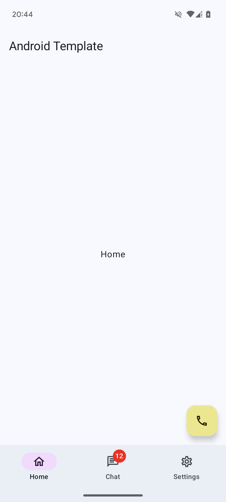

Android App Template
=

This Android app template provides a foundation for quickly starting development. It includes pre-configured dependencies, code samples, and project structure, simplifying the creation and setup of new applications. The template helps reduce configuration time and allows developers to focus on implementing functionality, ensuring a smooth start.

    

## Features
- [x] Included all Kotlin dependencies
- [x] Included all Google Play Services dependencies
- [x] Included all Google Play dependencies
- [x] Included all Google Material dependencies
- [x] Included all Firebase dependencies
- [x] Included all AndroidX dependencies
- [x] Included all popular third-party dependencies
- [x] Pre-built implementations:
    - [x] Koin
    - [x] Ktor
    - [x] Room
    - [x] DataStore
    - [x] Repository
    - [x] Interactor

## Configure
* In the current `readme.md` file, update the project name, badges, description, and screenshot.
* In `settings.gradle.kts`, update `rootProject.name`.
* Rename the application package.
* In the `build.gradle` file of the core module, update the `namespace`.
* In the `build.gradle` file of the app module, update the `namespace`, `applicationId`, and `archivesName`. If a release version is needed, add a `keystore.properties` file in the `config` directory.
* In `strings.xml`, update `app_name`.